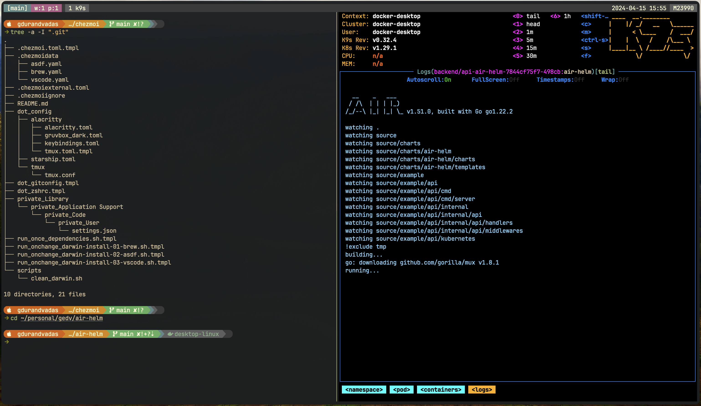

# My Dotfiles Configuration Guide

Welcome to the documentation of my dotfiles configuration tailored for macOS Darwin ARM environments. This guide assists you in setting up and understanding the configurations managed via [chezmoi](https://www.chezmoi.io/), which synchronizes and secures your setup across machines efficiently.

## Platform Requirements

This configuration is designed to run on macOS with the following dependencies managed by the dotfiles themselves:

- **Xcode**: Provides a comprehensive suite of development tools by Apple.
- **Rosetta**: Enables applications built for Intel chips to run on Apple Silicon.
- **Homebrew**: A package manager essential for installing and managing software.

## Brew Installation

Software packages are managed through Homebrew using a [`brew.yaml`](./.chezmoidata/brew.yaml) file, ensuring easy updates and synchronization across different machines. The specific software packages installed can be found within this file.

## Programming Languages Management with asdf

The `asdf` tool is used for managing multiple versions of programming languages on a per-project basis. This setup allows for easy switching between different versions as required by different projects. The configuration for `asdf` and its managed languages is detailed in the [`asdf.yaml`](./.chezmoidata/asdf.yaml) file.

## Visual Studio Code Configuration

Visual Studio Code is configured to enhance the development experience with specific extensions that cater to various programming needs. The extensions are installed automatically through chezmoi, and this setup is defined in the [`vscode.yaml`](./.chezmoidata/vscode.yaml) file. Note that only the extensions are managed by chezmoi.

## Cleaning Script Warning

⚠️ **Warning**: A script named `clean_darwin.sh` is included to remove all Homebrew packages. This script should be used with caution as it will completely uninstall all packages installed through Homebrew, potentially disrupting your setup.

> **Note**: It's up to the user's discretion to run this script. Ensure you understand the implications of executing it.

## Terminal Configuration

The terminal setup enhances both the functionality and aesthetics of your command line interface:

- **Zsh**: An advanced shell offering numerous improvements over its predecessors. [More about Zsh](https://support.apple.com/en-gb/102360).
- **Alacritty**: A GPU-accelerated terminal emulator known for its performance and simplicity. [Learn about Alacritty](https://alacritty.org/).
- **Tmux**: Allows for managing multiple terminal sessions within a single window, increasing productivity. [Explore Tmux](https://github.com/tmux/tmux/wiki).
- **Starship**: A fast, customizable prompt for any shell that keeps you productive at the command line. [Discover Starship](https://starship.rs/).

## Terminal Shortcuts

To enhance your workflow, we've included a series of keyboard shortcuts, particularly useful when working within tmux. Below is a table detailing these shortcuts:

| Key Combination               | Action                                          |
| ----------------------------- | ----------------------------------------------- |
| `Cmd` + `Shift` + `R`         | Reload tmux configuration                       |
| `Alt` + `Right`               | Jump to the next word                           |
| `Alt` + `Left`                | Jump to the previous word                       |
| `Cmd` + `D`                   | Split tmux pane horizontally                    |
| `Cmd` + `Shift` + `D`         | Split tmux pane vertically                      |
| `Cmd` + `Shift` + `Arrow Key` | Navigate between tmux panes                     |
| `Cmd` + `S`                   | Synchronize command input across all tmux panes |
| `Cmd` + `T`                   | Create a new tmux window                        |
| `Cmd` + `W`                   | Close the current tmux window                   |
| `Cmd` + `1` to `Cmd` + `0`    | Select tmux window by number                    |
| `Cmd` + `Arrow Up`            | Search up for substring in the terminal         |
| `Cmd` + `Arrow Down`          | Search down for substring in the terminal       |
