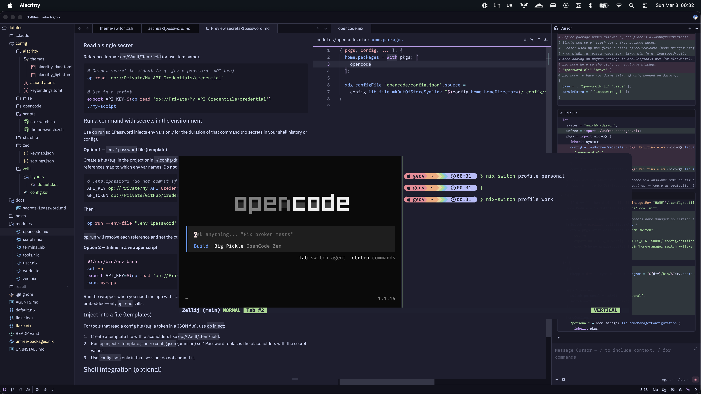

# dotfiles

**Goal:** A fast, GPU-friendly development environment with **agent management** (AI-assisted workflows, OpenCode, Cursor) and a **Rust-first** toolchain. Nix + Home Manager keep everything reproducible.



## First-time install

1. **Install Nix** (macOS):

   ```sh
   curl --proto '=https' --tlsv1.2 -sSf -L https://install.determinate.systems/nix | sh -s -- install
   ```

   Restart your terminal after install.

2. **Clone and enter the repo:**

   ```sh
   git clone https://github.com/gedv/dotfiles ~/.config/dotfiles
   cd ~/.config/dotfiles
   ```

3. **Create your identity file:**

   ```sh
   cp hosts/local.nix.example hosts/local.nix
   ```

   Edit `hosts/local.nix` with your name, emails, username, and GitHub handle (this file is gitignored).

4. **Apply your profile:**

   ```sh
   nix run .#switch-personal
   ```

   For the work profile: `nix run .#switch-work`. On a nix-darwin workstation you can use `dotfiles-switch` instead — see [docs/bootstrap.md](docs/bootstrap.md).

---

More details (structure, all bootstrap options, daily use, adding tools): **[docs/](docs/)**.
