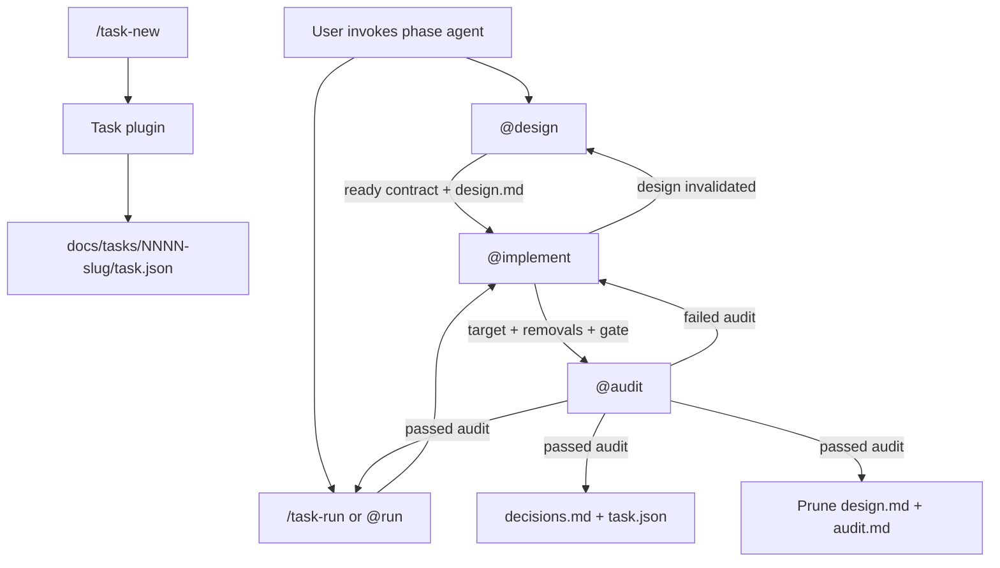

# OpenCode — Personal Profile

Personal OpenCode environment for everyday development and high-confidence task work. Launch it
with `oc-pers`, which symlinks this configuration to `~/.config/opencode-personal`.

The default agent is `@default`. Task-scale work reserves `gpt-5.6-sol` for the reasoning-critical
phases — `@design` and `@implement` at their respective reasoning depths, and `@audit` at high
effort as the gate. `@run` supervises the loop on `gpt-5.6-terra`, and standalone `@default` plus
read-only `@investigate` run on `gpt-5.6-luna`. OpenCode's built-in read-only `plan` agent is
disabled: `@design` owns the executable task design.

## Two Flows

| Flow | When | Entry | Persistent output |
|---|---|---|---|
| Standalone | Small, bounded edits and fixes | `oc-pers` (`@default`) | None |
| Task | Cross-cutting work, refactors, or changes needing an auditable state transition | `/task-new <description> --change-type=<type>` | `docs/tasks/<id>/decisions.md` |

The standalone flow is the default. Start a task when the work must replace an existing state,
needs user decisions, or spans more than a single cohesive implementation slice.

## Task Flow

A task is a bounded state transition in the target project, tracked under `docs/tasks/`. Its
workflow separates temporary reasoning from durable facts: design and audit documents are
scratchpads that are pruned after a passing audit; `decisions.md` survives as the compact record.



The deterministic task core enforces phase transitions and typed evidence contracts:

- `design → implement` requires a `design.md` plus a ready schema-v2 contract defining risk,
  change radius, path scope, acceptance criteria, and required evidence.
- `implement → audit` requires the plan of record, in-scope changes, and passing evidence.
- Only `task_close` can close a task. A passing close requires a complete `decisions.md` and zero
  foundational blockers; it then prunes temporary documents.
- A failing audit deterministically returns the task to implementation.

### Commands

```bash
/task-new auth migration --change-type=feat
/task-new --name="auth migration" --change-type=feat --new-branch=true
/task-new auth migration --change-type=feat --new-branch=false
/task-run 0007-auth-migration
/task-run 0007-auth-migration max=2
```

`/task-new` is plugin-backed and deterministic — no LLM questions or branch prompts.
`--change-type` (`feat`, `fix`, `doc`, `chore`, `refactor`, `perf`) is **required** and
creates or checks out `<type>/<id>-<description>`. Use `--new-branch=false` to check out an
existing branch (default: `true`). New branches are created atomically from the default branch
(`git switch -c <task-branch> <main|master|origin/HEAD>`) so HEAD never stops on the default
branch mid-setup. If branch setup fails, the task folder is rolled back.

`/task-run` deterministically checks out the requested task's recorded branch before invoking
`@run`; it then resumes from the task manifest's current phase.

### Branch enforcement

Task work must never commit on the default branch:

- Plugin blocks `git commit` on `main` / `master` (and any resolved default branch).
- Task-tagged commits (`[NNNN]`) are refused unless HEAD equals that task's recorded branch.
- `task_advance` to `implement` / `audit`, and a passing `task_close`, require HEAD on the task branch.
- `@implement` verifies `git branch --show-current` before committing.

After creation, invoke `@design` when you are ready.

### Phases

| Phase | Agent | Temporary output | Purpose |
|---|---|---|---|
| Design | `@design` | `design.md` | Investigate, decide, define the state transition and removal inventory, name the authoritative gate, and create the plan of record |
| Implement | `@implement` | Code changes | Delegate atomic changes, execute removal inventory, and run the declared gate |
| Audit | `@audit` | `audit.md` | Prove presence and absence, reconcile current guidance, then pass or fail the task |

Use `/task-run <id>` or `@run` to supervise the bounded implement/audit loop. You can still invoke
`@design`, `@implement`, and `@audit` individually when you want direct control.

### Durable Task Record

At a successful close, only these remain:

```text
docs/tasks/0007-auth-migration/
  task.json       # machine state, phase history, final status
  decisions.md    # durable state transition, rationale, removals, blast radius, evidence
```

`decisions.md` records:

- State transition and deliberately retained compatibility.
- Decisions and rationale.
- Superseded code, configuration, routes, dependencies, or terminology removed.
- Blast radius and verification evidence.
- Remaining work classified as business backlog, explicit compatibility, historical record, or
  foundational blocker.

Read a previous `decisions.md` for durable context. Do not treat historical task scratch documents
as an architecture map.

### `task.json`

```json
{
  "schema_version": 2,
  "id": "0007-auth-migration",
  "title": "Auth Migration",
  "status": "active",
  "current_phase": "design",
  "created_at": "2026-07-12",
  "updated_at": "2026-07-12",
  "branch": "feat/0007-auth-migration",
  "branch_checked_out": true,
  "docs": {
    "design": "design.md",
    "audit": "audit.md",
    "decisions": "decisions.md"
  },
  "phase_log": [
    { "phase": "design", "at": "2026-07-12T09:00:00Z", "note": "initial scope" }
  ],
  "contract": {
    "status": "ready",
    "risk": "medium",
    "change_radius": ["component"],
    "allowed_paths": ["src/**", "docs/tasks/**"],
    "forbidden_paths": ["src/generated/**"],
    "acceptance_criteria": ["component behavior is proven"],
    "required_evidence": [
      { "id": "component", "kind": "test", "command": "ayni verify test --language rust --package demo", "proves": "component behavior" }
    ]
  },
  "evidence": [],
  "metrics": {
    "total_ms": 5400000,
    "phases": [
      { "phase": "design", "visits": 1, "active_ms": 1800000 },
      { "phase": "implement", "visits": 2, "active_ms": 3000000 },
      { "phase": "audit", "visits": 2, "active_ms": 600000 }
    ],
    "repair_iterations": 1,
    "evidence_runs": 3,
    "evidence_pass": 2,
    "evidence_fail": 1,
    "computed_at": "2026-07-12T11:30:00Z"
  }
}
```

- `status`: `active` | `done`
- `current_phase`: `design` | `implement` | `audit`
- `branch`: git branch in `<type>/<id>-<description>` form (set after branch setup)
- `branch_checked_out`: whether the branch was created or checked out at task creation
- `phase_log`: append-only history, including returns to design or implementation.
- `metrics`: derived timing and throughput signals, recomputed from `phase_log` and `evidence` on
  every write and every read. Each phase is owned by one agent, so `active_ms` is that agent's
  wall-clock working window (spanning any user idle between transitions — the honest signal a
  file-based state machine can produce). `visits` counts phase entries; a return to a phase is a
  fresh visit, so `repair_iterations` (implement re-entries after a failed audit) falls out
  directly. `total_ms` runs from the first log entry to the last (closed) or to now (active).

### Custom Tools

| Tool | Purpose |
|---|---|
| `task_create` | Allocate an ID, create branch, write `task.json` (requires `change_type`) |
| `task_status` | Read task state, document presence, and suggested next agent |
| `task_list` | List tasks with phase and status |
| `task_contract` | Set or upgrade typed scope, risk, acceptance, and evidence requirements |
| `task_evidence` | Record one declared command result and optional artifact |
| `task_advance` | Perform a validated phase transition |
| `task_close` | Pass or fail audit; a pass validates durable evidence and prunes scratch docs |

### Commit Messages

Implementation commits use the task's 4-digit ID prefix:

```text
<type>(<scope>): [<id>] <description>
```

Example: `feat(auth): [0008] add password login handler`

`@implement` commits cohesive sequential implementation work; commits on the default branch are blocked.
`@audit` verifies task-tagged commits landed on the task branch where that convention applies.

## Agents

| Agent | Role |
|---|---|
| `default` | Standalone investigation and implementation, with no task documents |
| `design` | User-guided investigation, decisions, removal inventory, and executable design |
| `run` | Supervises the bounded `@implement → @audit` loop |
| `implement` | Coordinates atomic implementation and verifies cleanup plus quality gates |
| `audit` | Pass/fail state-transition gate and durable-record distiller |
| `investigate` | Read-only scoped evidence gathering |

## Directory Structure

```text
apps/opencode/
  README.md
  config.jsonc
  lib/task.ts              # deterministic state machine and close contract
  plugins/task.ts          # handles /task-new and prepares /task-run branches
  tools/task.ts            # task_create/status/list/advance/close
  agents/
    primary/
      default.md
      design.md
      audit.md
      run.md
    subagents/
      implement.md
      investigate.md
      code.md
  commands/
    task-new.md
    task-run.md
```

## Configuration

- `oc-pers` sets `OPENCODE_CONFIG` and `OPENCODE_CONFIG_DIR` to this directory.
- `oc-pers` sets `OPENCODE_DISABLE_LSP_DOWNLOAD=true` so OpenCode uses Home Manager language
  servers from `apps/opencode/module.nix` (`rust-analyzer`, `gopls`, `typescript-language-server`,
  `pyright`, `yaml-language-server`, `bash-language-server`, `sqls`, `vscode-langservers-extracted`).
- LSP is enabled in `config.jsonc` for Rust, Go, TypeScript/JavaScript, YAML, Python, Bash, JSON,
  and SQL. See [OpenCode LSP docs](https://opencode.ai/docs/lsp/).
- `default_agent: "default"` is configured in `config.jsonc`.
- External projects under `~/Development/personal/**` and `~/Development/arai/**` are allowed.
- Destructive commands (`git reset`, `git clean`, force push, `rm`, and `sudo`) are denied.

## MCP — GitHub

Remote GitHub MCP is configured at `https://api.githubcopilot.com/mcp/` with PAT authentication.
`oc-pers` exports `GITHUB_PERSONAL_ACCESS_TOKEN` from `gh auth token` when available.

```bash
opencode mcp list
opencode mcp debug github
```
