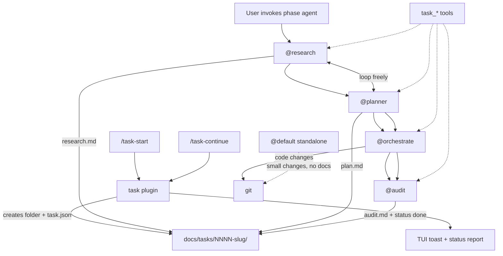

# OpenCode — Personal Profile

Personal OpenCode environment for everyday development and structured task work. Launched via `oc-pers` (symlinked from dotfiles to `~/.config/opencode-personal`).

Uses OpenAI: `gpt-5.6-sol` for orchestration and research, `gpt-5.6-terra` for audit, default, planning, and code, and `gpt-5.6-luna` for investigation. Default landing agent is `default`. OpenCode's built-in read-only `plan` agent is disabled — task planning uses `@planner` instead.

## Two Flows

| Flow | When | Entry | Docs |
|------|------|-------|------|
| **Standalone** | Small, bounded changes — bugfixes, single-file edits, quick refactors | `oc-pers` (lands on `@default`) | None |
| **Task** | Large changes, refactors, cross-cutting work needing memory and audit trail | `/task-start <description>` | `docs/tasks/<id>/` |

The standalone flow is the default. The task flow is opt-in — use it when you need durable reasoning, human-in-the-loop decisions, and a record of what was actually built.

## Standalone Flow (`default`)

The `default` agent investigates and implements in one context. It may delegate to `@investigate` or `@code` if the task grows, but writes no task docs.

If scope turns out to be task-scale, it will suggest `/task-start`.

```bash
oc-pers                    # lands on @default
oc-pers --agent default    # explicit
```

## Task Flow

A **task** is a bounded unit of work with a distinct start and end, tracked by ID under `docs/tasks/` in the **target project** (not in dotfiles).

Bootstrap and status reporting are **deterministic** — handled by a plugin and custom tools with zero unprompted LLM research. Phase agents run only when you explicitly invoke them.



Phases are lenses over one shared folder — not a rigid pipeline. `@research` and `@planner` can loop; `@orchestrate` and `@audit` generally follow planning and implementation.

### Commands

```bash
/task-start auth migration     # plugin: allocate ID, create folder (no auto-research)
/task-continue 0007              # plugin: report phase/status
/task-continue 0007-auth-migration
```

After `/task-start`, switch to `@research` when you are ready to investigate.

### Commit Messages

Implementation commits must tag the task using its **4-digit ID prefix**:

```
<type>(<scope>): [<id>] <description>
```

Example for task `0008-auth-migration`:

```
feat(auth): [0008] add password login handler
```

- **id** — 4-digit prefix from the task folder name (`0008`, not the full slug)
- **type** — conventional commit type (`feat`, `fix`, `refactor`, `docs`, `test`, `chore`, …)
- **scope** — optional module or area
- `@code` commits during `@orchestrate`; `@audit` verifies commits in `git log`

### Custom Tools

Phase agents use deterministic tools instead of hand-editing `task.json`:

| Tool | Purpose |
|------|---------|
| `task_create` | Create task (also used internally by plugin) |
| `task_status` | Read manifest, doc presence, suggested next agent |
| `task_list` | List all tasks |
| `task_advance` | Update phase, append phase_log, optionally close |

### On-Disk Layout

```
docs/tasks/0007-auth-migration/
  task.json   # machine state — phase pointer, status, history
  research.md       # foundations, assumptions, decisions
  plan.md           # implementation plan
  audit.md          # reconciliation, blast radius
```

### task.json

JSON holds machine state agents read and update. Markdown holds human-readable reasoning.

```json
{
  "id": "0007-auth-migration",
  "title": "Auth Migration",
  "status": "active",
  "current_phase": "research",
  "created_at": "2026-07-07",
  "updated_at": "2026-07-07",
  "docs": {
    "research": "research.md",
    "plan": "plan.md",
    "audit": "audit.md"
  },
  "phase_log": [
    { "phase": "research", "at": "2026-07-07T09:00:00Z", "note": "initial scope" }
  ]
}
```

- `status`: `active` | `done`
- `current_phase`: `research` | `plan` | `implement` | `audit`
- `phase_log`: append-only — supports non-linear movement (e.g. `research → plan → research`)

IDs are `NNNN-<kebab-slug>` (4-digit zero-padded sequence + slug). The next ID is allocated by scanning `docs/tasks/` for the highest existing number.

### Phases

Phases are **lenses over one shared folder**, not a rigid pipeline. Any phase can loop; movement is recorded via `task_advance`.

| Phase | Agent | Produces | Purpose |
|-------|-------|----------|---------|
| Research | `@research` | `research.md` | Investigate codebase + web, spar on options, record assumptions and decisions |
| Plan | `@planner` | `plan.md` | Turn research into ordered tasks; ask before assuming |
| Implement | `@orchestrate` | code changes (git) | Delegate atomic work to `@code`; advance phase via tool |
| Audit | `@audit` | `audit.md` | Reconcile plan vs reality; document blast radius; close task |

You invoke phase agents explicitly: `@research`, `@planner`, `@orchestrate`, `@audit`.

`@research` waits for your direction before investigating — it does not auto-research on spawn.

### What Each Doc Captures

| Question | Answered in |
|----------|-------------|
| Why did we make this assumption? | `research.md` → Assumptions & Decisions |
| Why did implementation deviate? | `audit.md` → Deviations & Rationale |
| What breaks if we change this? | `audit.md` → Blast Radius |

Future refactors should read prior task `research.md` and `audit.md` before touching code.

### Typical Paths

Linear:

```
/task-start → (you decide) → @research → @planner → @orchestrate → @audit → done
```

Non-linear (normal):

```
@research → @planner → @research (gap found) → @planner → @orchestrate → @audit
```

Check status anytime:

```
/task-continue 0007-auth-migration
```

## Agents

### Primary

| Agent | Role |
|-------|------|
| `default` | Standalone — investigate + implement, no docs |
| `research` | Investigation + web de-bias + assumptions/decisions (waits for user direction) |
| `planner` | Implementation planning, persisted to `plan.md` |
| `orchestrate` | Execution coordinator — delegates to `@code` |
| `audit` | Post-implementation reconciliation + blast radius |

### Subagents

| Agent | Role |
|-------|------|
| `investigate` | Read-only scoped research (codebase, web, MCP) |
| `code` | Atomic implementation tasks delegated by `@orchestrate` |

## Directory Structure

```
personal/
  README.md              # this file
  config.jsonc           # OpenAI provider, default_agent, permissions
  package.json           # @opencode-ai/plugin for tools/plugins
  lib/
    task.ts        # deterministic task core
  plugins/
    task.ts        # intercepts /task-start and /task-continue
  tools/
    task.ts        # task_create/status/list/advance tools
  agents/
    primary/
      default.md
      research.md
      planner.md
      orchestrate.md
      audit.md
    subagents/
      investigate.md
      code.md
  commands/
    task-start.md
    task-continue.md
  skills/                # (empty — add personal skills here)
```

## Configuration

- **Launch:** `oc-pers` sets `OPENCODE_CONFIG` and `OPENCODE_CONFIG_DIR` to this directory.
- **Default agent:** `default_agent: "default"` in `config.jsonc`.
- **External directories:** `~/Development/personal/**` and `~/Development/arai/**` are allowed.
- **Destructive commands:** `git reset`, `git clean`, `git push --force`, `rm`, `sudo` are denied globally.
- **Plugins/tools:** OpenCode runs `bun install` at startup for `package.json` dependencies.

## MCP — GitHub

Remote GitHub MCP is configured at `https://api.githubcopilot.com/mcp/` with PAT auth (`oauth: false`).

`oc-pers` exports `GITHUB_PERSONAL_ACCESS_TOKEN` automatically when `gh auth token` is available. Otherwise set it yourself:

```bash
export GITHUB_PERSONAL_ACCESS_TOKEN="$(op read 'op://Private/GitHub/credential')"
oc-pers
```

Verify after launch:

```bash
opencode mcp list
opencode mcp debug github
```
