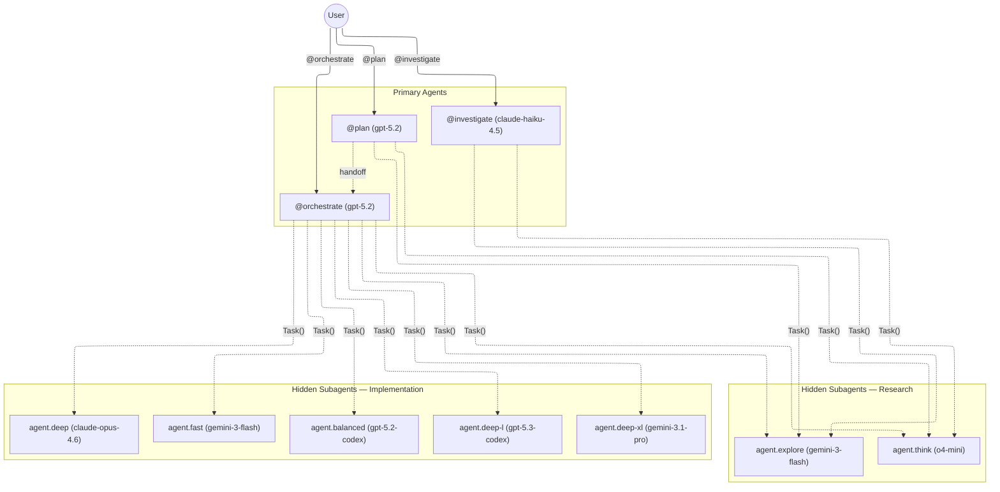

# OpenCode Agent Architecture

## Agent Flow

## Primary Agents

These are user-facing agents selectable via `@agent` in the chat.

| Agent           | Model            | Role                                                                                                                               |
| --------------- | ---------------- | ---------------------------------------------------------------------------------------------------------------------------------- |
| **plan**        | gpt-5.2          | Analyzes requests, gathers context, and produces execution-ready plans for orchestrate. Read-only.                                 |
| **investigate** | claude-haiku-4.5 | Explores codebases, answers questions, and builds understanding. Read-only. No plans, no changes.                                  |
| **orchestrate** | gpt-5.2          | Execution coordinator. Delegates to subagents, enforces quality gates, drives tasks to completion. Cannot read/edit/bash directly. |

### Primary Agent Permissions

| Agent       | read  | edit | bash | task           |
| ----------- | ----- | ---- | ---- | -------------- |
| plan        | allow | deny | deny | explore, think |
| investigate | allow | deny | deny | explore, think |
| orchestrate | deny  | deny | deny | all            |

## Hidden Subagents

These are only invocable via `Task()` from primary agents or orchestrate. They never appear in the agent picker.

### Research Subagents

| Agent             | Model          | Context | Role                                                    |
| ----------------- | -------------- | ------- | ------------------------------------------------------- |
| **agent.explore** | gemini-3-flash | 2M      | Read-only file discovery and search. No bash.           |
| **agent.think**   | o4-mini        | 200K    | Deep analysis and reasoning. Dedicated reasoning model. |

### Implementation Subagents

All implementation agents share `prompts/implementer.md` as their system prompt. They cannot spawn further subagents (`task: deny`), preventing unbounded delegation chains.

| Agent              | Model           | Context | Role                                       | When to use                                     |
| ------------------ | --------------- | ------- | ------------------------------------------ | ----------------------------------------------- |
| **agent.fast**     | gemini-3-flash  | 2M      | Small-scope edits, docs, tests             | Quick, low-risk, bounded changes                |
| **agent.balanced** | gpt-5.2-codex   | 272K    | Standard multi-file features and refactors | Typical implementation work                     |
| **agent.deep**     | claude-opus-4.6 | 1M      | Complex, cross-cutting implementation      | Uncertain scope, hard debugging, careful design |
| **agent.deep-l**   | gpt-5.3-codex   | 272K    | Large-context implementation               | Broad-scope work spanning many files            |
| **agent.deep-xl**  | gemini-3.1-pro  | 2M      | Extra-large context implementation         | Broadest-scope work, massive codebases          |

## Default Model

The fallback model (used when no agent is selected) is **gpt-5-mini**. The `default_agent` is set to `plan`.

## Pricing Reference

| Model            | Input (per 1M tokens) | Output (per 1M tokens) |
| ---------------- | --------------------- | ---------------------- |
| gpt-5-mini       | $0.25                 | $2.00                  |
| gemini-3-flash   | $0.50                 | $3.00                  |
| claude-haiku-4.5 | $1.00                 | $5.00                  |
| o4-mini          | $1.10                 | $4.40                  |
| gpt-5.2          | $1.75                 | $14.00                 |
| gemini-3.1-pro   | $2.00                 | $12.00                 |
| gpt-5.2-codex    | —                     | —                      |
| gpt-5.3-codex    | —                     | —                      |
| claude-opus-4.6  | $5.00                 | $25.00                 |

## Design Principles

- **Spend intelligence where code gets written** — cheap models for routing and file reading, expensive models for complex implementation
- **No unbounded delegation** — implementation agents have `task: deny`
- **Orchestrate never touches files directly** — it must delegate, ensuring all work is auditable through subagent outputs
- **Read-only primary agents** — plan and investigate cannot modify anything, keeping analysis safe and side-effect free
- **Routing by risk, not size** — orchestrate selects subagents based on uncertainty and blast radius, not raw file/line counts
