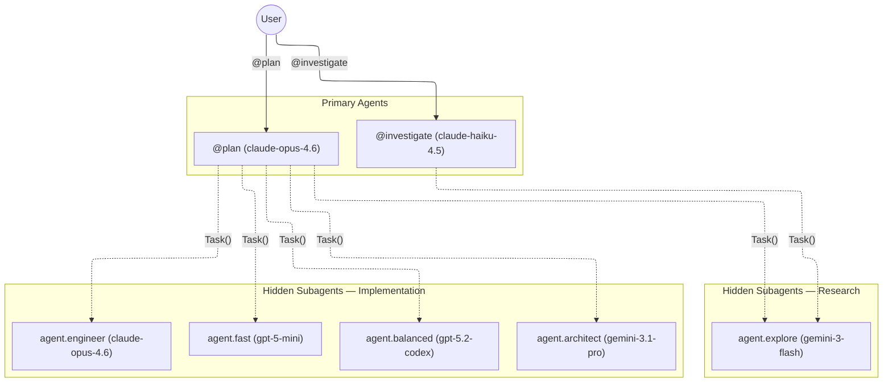

# OpenCode Agent Architecture

## Agent Flow

## Primary Agents

These are user-facing agents selectable via `@agent` in the chat.

| Agent           | Model            | Role                                                                                              |
| --------------- | ---------------- | ------------------------------------------------------------------------------------------------- |
| **plan**        | claude-opus-4.6  | Plans and executes tasks by analyzing requests and delegating to the right subagent.              |
| **investigate** | claude-haiku-4.5 | Explores codebases, answers questions, and builds understanding. Read-only. No plans, no changes. |

### Primary Agent Permissions

| Agent       | read  | edit | bash | task         |
| ----------- | ----- | ---- | ---- | ------------ |
| plan        | allow | deny | deny | all          |
| investigate | allow | deny | deny | explore only |

## Hidden Subagents

These are only invocable via `Task()` from primary agents. They never appear in the agent picker.

### Research Subagent

| Agent             | Model          | Context | Role                                          |
| ----------------- | -------------- | ------- | --------------------------------------------- |
| **agent.explore** | gemini-3-flash | 2M      | Read-only file discovery and search. No bash. |

### Implementation Subagents

All implementation agents share `prompts/implementer.md` as their system prompt. They cannot spawn further subagents (`task: deny`), preventing unbounded delegation chains.

| Agent               | Model           | Context | Role                                       | When to use                                     |
| ------------------- | --------------- | ------- | ------------------------------------------ | ----------------------------------------------- |
| **agent.fast**      | gpt-5-mini      | —       | Small-scope edits, docs, tests             | Quick, low-risk, bounded changes                |
| **agent.balanced**  | gpt-5.2-codex   | 272K    | Standard multi-file features and refactors | Typical implementation work                     |
| **agent.engineer**  | claude-opus-4.6 | 1M      | Complex, cross-cutting implementation      | Uncertain scope, hard debugging, careful design |
| **agent.architect** | gemini-3.1-pro  | 2M      | Broadest-scope implementation              | Large-scale refactors, massive codebases        |

## Default Model

The fallback model (used when no agent is selected) is **gpt-5-mini**. The `default_agent` is set to `plan`.

## Design Principles

- **Single coordinator** — plan agent handles both planning and delegation, eliminating handoff overhead
- **Spend intelligence where code gets written** — cheap models for routing and file reading, expensive models for complex implementation
- **No unbounded delegation** — implementation agents have `task: deny`
- **Plan never touches files directly** — it must delegate, ensuring all work is auditable through subagent outputs
- **Routing by risk, not size** — plan selects subagents based on uncertainty and blast radius, not raw file/line counts
- **Lean context** — no orchestration skills loaded by default; language/domain skills loaded on-demand by subagents
